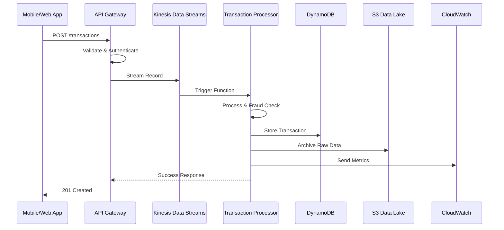

# SecureBank Transaction Pipeline - Architecture Guide

## 🏗️ System Architecture Overview

The SecureBank Transaction Pipeline implements a modern, cloud-native architecture using AWS serverless services. The system is designed for high throughput, low latency, and automatic scaling while maintaining strong security and compliance posture.

## 📐 Architectural Principles

### 1. Event-Driven Architecture
- **Asynchronous Processing**: Decouple components using events
- **Reactive Scaling**: Scale based on actual demand
- **Fault Tolerance**: Isolated failures don't cascade

### 2. Serverless-First
- **No Infrastructure Management**: Focus on business logic
- **Automatic Scaling**: From zero to thousands of requests
- **Pay-per-Use**: Cost optimization through usage-based pricing

### 3. Microservices Pattern
- **Single Responsibility**: Each service has one clear purpose
- **Independent Deployment**: Services can be updated independently
- **Technology Diversity**: Choose best tool for each job

### 4. Security by Design
- **Zero Trust**: Verify every request and access
- **Encryption Everywhere**: Data protection at rest and in transit
- **Principle of Least Privilege**: Minimal required permissions

## 🔄 Data Flow Architecture



## 🏛️ Component Architecture

### 1. Ingestion Layer

#### API Gateway
```yaml
Configuration:
  Type: REST API
  Authentication: AWS_IAM + API Keys
  Throttling: 10,000 requests/second
  Caching: 5-minute TTL for read operations
  
Endpoints:
  - POST /v1/transactions
  - GET /v1/transactions/{id}
  - GET /v1/health
  
Security:
  - Request validation
  - Rate limiting per client
  - CORS enabled for web clients
```

#### Kinesis Data Streams
```yaml
Configuration:
  Stream Name: securebank-transactions
  Shard Count: 4 (auto-scaling enabled)
  Retention Period: 24 hours
  Encryption: Server-side with KMS
  
Partitioning Strategy:
  Partition Key: customer_id
  Benefits: 
    - Even distribution across shards
    - Customer transactions stay in order
    - Parallel processing capability
```

### 2. Processing Layer

#### Lambda Functions

##### Transaction Processor
```python
# Function Configuration
Runtime: Python 3.9
Memory: 512 MB
Timeout: 30 seconds
Concurrency: 1000 (reserved)
Dead Letter Queue: Enabled

# Event Sources
- Kinesis Data Streams (batch size: 100)
- CloudWatch Events (for scheduled tasks)

# Environment Variables
DYNAMODB_TABLE_NAME: SecureBank-Transactions
S3_BUCKET_NAME: securebank-data-lake
FRAUD_THRESHOLD: 0.8
LOG_LEVEL: INFO
```

##### Fraud Detection Engine
```python
# Fraud Detection Rules
rules:
  velocity_check:
    description: "Multiple transactions in short time"
    threshold: 5 transactions per hour
    weight: 0.4
    
  amount_anomaly:
    description: "Unusual transaction amount"
    threshold: 3x customer average
    weight: 0.3
    
  location_anomaly:
    description: "Transaction from unusual location"
    threshold: 500+ miles from last transaction
    weight: 0.2
    
  time_anomaly:
    description: "Transaction at unusual time"
    threshold: Outside 6 AM - 10 PM
    weight: 0.1

# Scoring Algorithm
risk_score = sum(rule_weight * rule_triggered)
fraud_flag = risk_score > 0.8
```

### 3. Storage Layer

#### DynamoDB Design

##### Transactions Table
```yaml
Table Name: SecureBank-Transactions
Partition Key: customer_id (String)
Sort Key: timestamp (String)
Billing Mode: On-Demand

Global Secondary Indexes:
  TransactionIdIndex:
    Partition Key: transaction_id
    Purpose: Direct transaction lookup
    
  MerchantIndex:
    Partition Key: merchant_id
    Sort Key: timestamp
    Purpose: Merchant analytics

Local Secondary Indexes:
  AmountIndex:
    Sort Key: amount
    Purpose: Query by amount ranges

Attributes:
  - transaction_id: String
  - customer_id: String
  - amount: Number
  - currency: String
  - merchant_id: String
  - merchant_category: String
  - timestamp: String (ISO 8601)
  - location: Map
  - is_fraud: Boolean
  - risk_score: Number
  - processed_timestamp: String
```

##### Customer Profiles Table
```yaml
Table Name: SecureBank-Customers
Partition Key: customer_id (String)
Billing Mode: On-Demand

Attributes:
  - customer_id: String
  - account_created: String
  - risk_profile: String (low/medium/high)
  - average_monthly_spend: Number
  - location: Map
  - preferred_merchants: List
  - last_transaction_timestamp: String
  - total_transactions: Number
  - total_fraud_flags: Number
```

#### S3 Data Lake Structure
```
s3://securebank-data-lake/
├── raw/
│   └── transactions/
│       └── year=2024/
│           └── month=01/
│               └── day=15/
│                   └── hour=14/
│                       ├── txn_001.json
│                       └── txn_002.json
├── processed/
│   ├── daily-aggregates/
│   │   └── year=2024/month=01/day=15/
│   │       └── daily-stats.parquet
│   ├── customer-profiles/
│   └── fraud-patterns/
└── analytics/
    ├── athena-results/
    └── redshift-staging/
```

### 4. Analytics Layer

#### AWS Glue ETL Jobs

##### Daily Aggregation Job
```python
# Job Configuration
Job Name: daily-transaction-aggregation
Job Type: Spark
Worker Type: G.1X
Number of Workers: 2
Schedule: Daily at 2 AM UTC

# Transformations
input: S3 raw transactions (previous day)
transformations:
  - Group by customer_id, merchant_category
  - Calculate: count, sum, avg, min, max amounts
  - Detect spending pattern changes
  - Flag unusual merchant categories
output: S3 processed/daily-aggregates/
```

##### Fraud Pattern Analysis
```python
# Job Configuration  
Job Name: fraud-pattern-analysis
Job Type: Spark
Schedule: Weekly on Sundays

# Analysis
- Identify common fraud patterns
- Calculate false positive/negative rates
- Update fraud detection thresholds
- Generate fraud trend reports
```

#### Amazon Athena Configuration
```sql
-- Partition Projection for Performance
CREATE EXTERNAL TABLE transactions (
  transaction_id string,
  customer_id string,
  amount double,
  -- ... other fields
)
PARTITIONED BY (
  year string,
  month string,
  day string,
  hour string
)
STORED AS JSON
LOCATION 's3://securebank-data-lake/raw/transactions/'
TBLPROPERTIES (
  'projection.enabled' = 'true',
  'projection.year.type' = 'integer',
  'projection.year.range' = '2024,2030',
  'projection.month.type' = 'integer',
  'projection.month.range' = '1,12',
  'projection.month.digits' = '2',
  'projection.day.type' = 'integer',
  'projection.day.range' = '1,31',
  'projection.day.digits' = '2',
  'projection.hour.type' = 'integer',
  'projection.hour.range' = '0,23',
  'projection.hour.digits' = '2'
);
```

### 5. Monitoring & Observability

#### CloudWatch Architecture
```yaml
Metrics:
  Custom Metrics:
    - SecureBank/Transactions/ProcessedCount
    - SecureBank/Fraud/DetectedCount
    - SecureBank/API/ResponseTime
    - SecureBank/Costs/DailySpend
    
  Log Groups:
    - /aws/lambda/transaction-processor
    - /aws/apigateway/securebank-api
    - /aws/glue/daily-aggregation
    
Alarms:
  - High fraud rate (>5% in 5 minutes)
  - API latency >100ms for 3 consecutive periods
  - Lambda error rate >1% for 2 consecutive periods
  - DynamoDB throttling events
  
Dashboards:
  - Operations Dashboard
  - Business Metrics Dashboard
  - Cost Optimization Dashboard
```

## 🔒 Security Architecture

### Network Security
```yaml
VPC Configuration:
  Public Subnets: API Gateway endpoints
  Private Subnets: Lambda functions, database access
  NAT Gateway: Outbound internet access for Lambda
  VPC Endpoints: S3, DynamoDB, Kinesis access
  
Security Groups:
  Lambda SG: Outbound HTTPS only
  Database SG: Inbound from Lambda SG only
```

### Identity & Access Management
```yaml
Roles:
  TransactionProcessorRole:
    Services: lambda.amazonaws.com
    Policies:
      - DynamoDB: PutItem, GetItem, Query on specific tables
      - S3: PutObject on specific buckets
      - Kinesis: Read from specific streams
      - CloudWatch: PutMetricData, CreateLogGroup
      
  APIGatewayRole:
    Services: apigateway.amazonaws.com
    Policies:
      - Kinesis: PutRecord on specific streams
      - CloudWatch: Logging permissions
      
  GlueServiceRole:
    Services: glue.amazonaws.com
    Policies:
      - S3: Read/Write on data lake buckets
      - Glue: Catalog access
```

### Encryption Strategy
```yaml
Data at Rest:
  S3: SSE-S3 (AES-256)
  DynamoDB: AWS managed KMS keys
  CloudWatch Logs: KMS encryption
  
Data in Transit:
  API Gateway: TLS 1.2+
  Inter-service: HTTPS/TLS
  Database connections: Encrypted
  
Key Management:
  KMS: Customer managed keys for sensitive data
  Rotation: Annual automatic rotation
  Access: Strict IAM policies
```

## 📊 Performance Architecture

### Scalability Patterns
```yaml
Auto Scaling:
  API Gateway: Automatic (10,000 RPS default)
  Lambda: Concurrent executions (1,000 reserved)
  DynamoDB: On-demand scaling
  Kinesis: Auto-scaling enabled (2-40 shards)

Optimization Strategies:
  Lambda:
    - Provisioned concurrency for critical functions
    - Connection pooling for database access
    - Efficient memory allocation (512MB optimal)
    
  DynamoDB:
    - Composite keys for even data distribution
    - Sparse indexes for cost optimization
    - DynamoDB Accelerator (DAX) for read-heavy workloads
    
  S3:
    - Intelligent tiering for cost optimization
    - Transfer acceleration for global access
    - Multipart uploads for large objects
```

### Caching Strategy
```yaml
Levels:
  API Gateway: 5-minute cache for read operations
  Lambda: In-memory caching for customer profiles
  DynamoDB: DAX for microsecond latency
  Athena: Query result caching (24 hours)

Cache Invalidation:
  - Time-based expiration
  - Event-driven invalidation
  - Manual cache busting for urgent updates
```

## 🔄 Disaster Recovery

### Backup Strategy
```yaml
DynamoDB:
  Point-in-time Recovery: Enabled (35 days)
  On-demand Backups: Weekly full backups
  Cross-region Replication: For critical tables
  
S3:
  Versioning: Enabled on all buckets
  Cross-region Replication: Critical data only
  Lifecycle Policies: Transition to IA/Glacier
  
Recovery Objectives:
  RTO (Recovery Time Objective): 1 hour
  RPO (Recovery Point Objective): 5 minutes
```

### Multi-Region Architecture (Future)
```yaml
Primary Region: us-east-1
Secondary Region: us-west-2

Replication:
  DynamoDB: Global tables
  S3: Cross-region replication
  Lambda: Identical deployments
  
Failover:
  Route 53: Health checks and DNS failover
  Lambda: Cross-region invocation capability
  Data: Eventual consistency acceptable
```

## 🧪 Testing Architecture

### Test Data Generation
```python
# Realistic test data patterns
transaction_patterns:
  normal:
    - Regular merchant categories
    - Typical amounts for customer profile
    - Normal time patterns
    - Consistent geographic locations
    
  fraudulent:
    - Velocity attacks (rapid transactions)
    - Location impossibilities
    - Amount anomalies
    - Unusual time patterns
    - Merchant category deviations
```

### Performance Testing
```yaml
Load Testing:
  Tool: Custom Python scripts + AWS SDK
  Targets:
    - API Gateway: 1,000 RPS sustained
    - Lambda: 500 concurrent executions
    - DynamoDB: 10,000 WCU/RCU
    
Chaos Engineering:
  - Random Lambda failures
  - DynamoDB throttling simulation
  - Network partition testing
  - Multi-AZ failure scenarios
```

## 📈 Cost Architecture

### Cost Optimization
```yaml
Reserved Capacity:
  DynamoDB: Reserved capacity for predictable workloads
  S3: Storage class analysis for optimal tiering
  
Lifecycle Management:
  S3: Automatic transition to IA after 30 days
  CloudWatch Logs: 7-day retention for debug logs
  
Monitoring:
  AWS Cost Explorer: Daily cost monitoring
  Billing Alarms: $100, $200, $500 thresholds
  Resource Tagging: Cost allocation by component
```

### Resource Rightsizing
```yaml
Lambda:
  Memory: Start with 512MB, optimize based on CloudWatch
  Timeout: Minimum required (typically 30 seconds)
  
DynamoDB:
  Capacity: On-demand for variable workloads
  Indexes: Only create necessary GSIs/LSIs
  
Kinesis:
  Shards: Start with 2, auto-scale based on throughput
```

This architecture provides a robust, scalable, and cost-effective foundation for processing financial transactions while maintaining the highest standards of security and compliance.